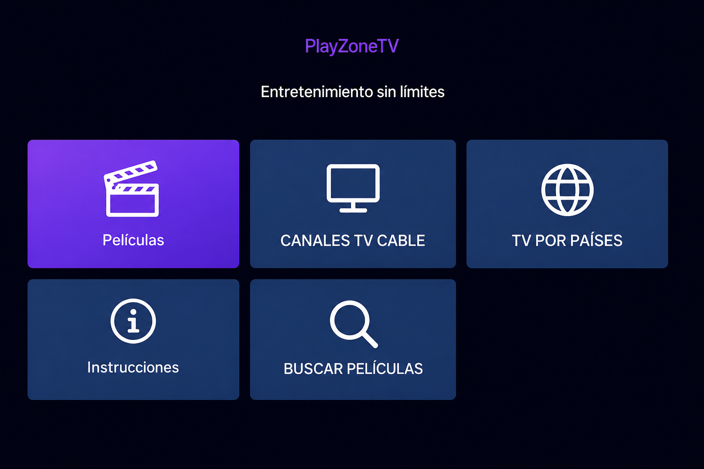
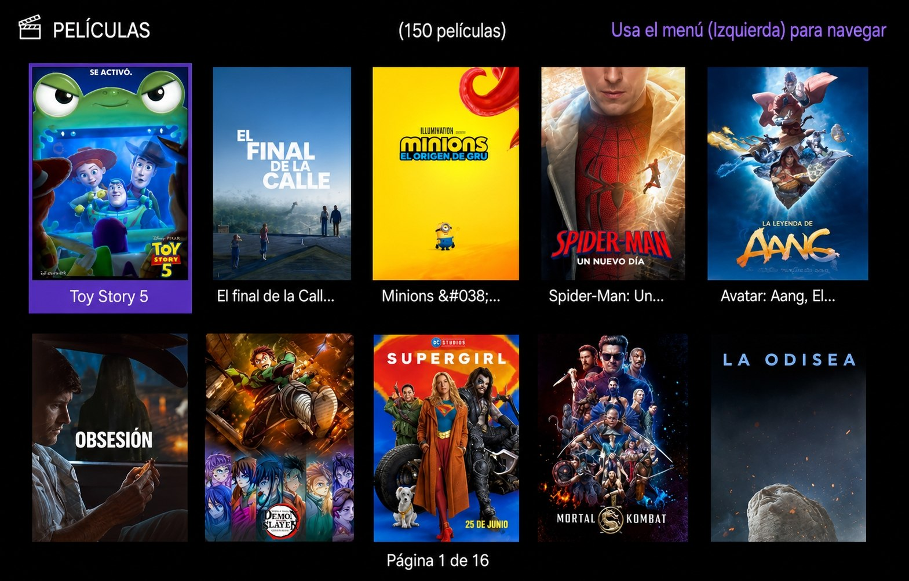
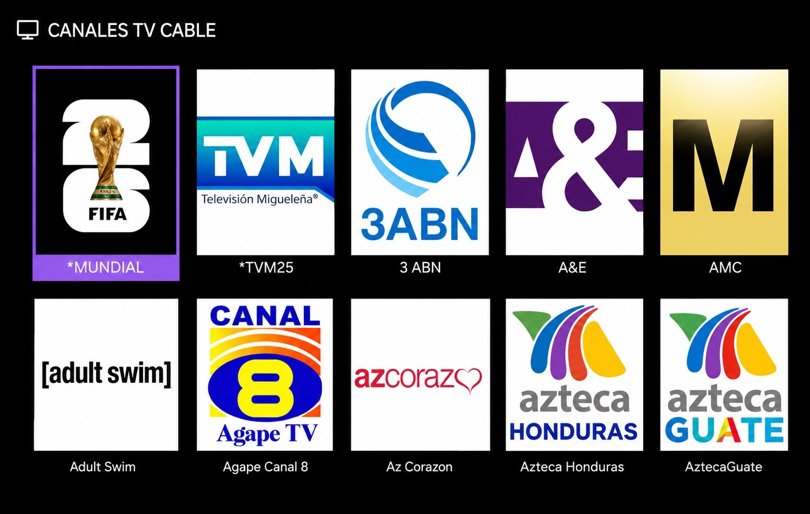
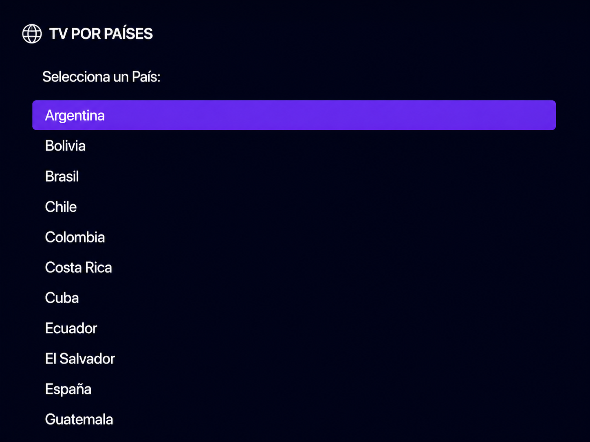

<div align="center">

# 🎬 PlayZoneTV

### Canal de streaming para Roku — Películas, Canales de TV y Contenido por País


</div>

---

## 📌 ¿Qué es PlayZoneTV?

**PlayZoneTV** es un canal privado para **Roku** (BrightScript / SceneGraph).

Incluye:

- 🎥 **Películas** — catálogo con detalle, rating, géneros y reproducción  
- 📡 **Canales de TV por cable**  
- 🌎 **TV por países** (IPTV)  
- 🔎 **Buscador** de películas  
- 📖 **Instrucciones** dentro de la app  

No está en la Roku Channel Store: se instala por **sideload** (modo desarrollador).

---

## 🖼️ Capturas de pantalla

> Sustituye las rutas por tus imágenes (por ejemplo en una carpeta `docs/screenshots/` del repo, o enlaces directos).

### 🏠 Menú principal (portal)



*Portal de inicio: Películas, Canales TV cable, TV por países, Instrucciones y Buscar.*

---

### 🎥 Películas



*Catálogo con portadas, paginación y detalle de cada título.*


*Ficha con sinopsis, rating y botón Reproducir.*

---

### 📡 Canales TV cable



*Listado de canales por cable a partir de listas M3U.*

---

### 🌎 TV por países



*Selección de país y canales IPTV asociados.*

---

## 📥 Descarga

Descarga el canal empaquetado desde MediaFire:

> **🔗 [Descargar PlayZoneTV (ZIP)]([https://www.mediafire.com/](https://www.mediafire.com/file/1jzgde3cx2hfpmt/PlayZoneTV.zip/file))** 

---

## ⚙️ Requisitos

- 📺 Un **Roku** físico  
- 📶 Misma red Wi‑Fi que tu computadora  
- 💻 PC o celular con navegador  
- 🔢 Conocer la **IP** del Roku (sale al activar modo desarrollador)

---

## 🔓 Activar modo desarrollador

Con el control del Roku, en la **pantalla de inicio**, pulsa esta secuencia **sin pausas largas**:

| Paso | Botón | Veces |
|:----:|:-----:|:-----:|
| 1️⃣ | 🏠 **Inicio** (Home) | **3** |
| 2️⃣ | ⬆️ **Arriba** | **2** |
| 3️⃣ | ⬅️ **Izquierda** | **1** |
| 4️⃣ | ➡️ **Derecha** | **1** |
| 5️⃣ | ⬅️ **Izquierda** | **1** |
| 6️⃣ | ➡️ **Derecha** | **1** |
| 7️⃣ | ⬅️ **Izquierda** | **1** |

Resumen rápido:

```text
🏠 🏠 🏠   →   ⬆️ ⬆️   →   ⬅️  →  ➡️  →  ⬅️  →  ➡️  →  ⬅️
```

Luego verás **Developer Application Installer**:

1. 👤 Usuario: `rokudev`  
2. 🔑 Elige una **contraseña** y anótala  
3. 📍 Anota la **IP** del Roku (ejemplo: `192.168.1.20`)  
4. ✅ Acepta los términos — el Roku se reinicia  

> 💡 Si ya activaste el modo desarrollador antes, puede abrir el instalador sin repetir la secuencia.

---

## 📲 Instalar PlayZoneTV (sideload)

1. 📥 Descarga el ZIP desde el enlace de MediaFire (arriba).  
2. 🌐 En la computadora abre el navegador y entra a:

   ```text
   http://IP-DE-TU-ROKU
   ```

   Ejemplo: `http://192.168.1.20`

3. 🔐 Inicia sesión:
   - Usuario: `rokudev`  
   - Contraseña: la que configuraste  

4. 📤 En **Upload** → **Choose File** → selecciona el ZIP.  
5. ▶️ Pulsa **Install** (o **Replace** si ya lo tenías).  
6. 🎉 En unos segundos se abre **PlayZoneTV** y queda en canales instalados (sideload).

---

## 🕹️ Cómo usar

| Acción | Control |
|--------|---------|
| ⬆️⬇️⬅️➡️ Moverse | Flechas |
| ✅ Elegir | **OK** |
| 📋 Menú lateral | **Izquierda** (en el primer póster) |
| ↩️ Volver | **Atrás** |
| ⌨️ Buscar | Teclado en pantalla o teclado del celular (app Roku) |

Menú lateral: **Inicio** · **Siguiente página** · **Página anterior** · **Buscar** · **Cerrar**.

Si un video no se puede reproducir en Roku, verás un mensaje y podrás volver con **Atrás**.

---

## 📬 Contacto

Dudas o soporte: **Telegram** [@I_am3301](https://t.me/I_am3301)

---

## 📄 Licencia

MIT — uso libre según los términos de la licencia.

---

<div align="center">

Hecho con ❤️ para la comunidad Roku · **PlayZoneTV**

</div>
